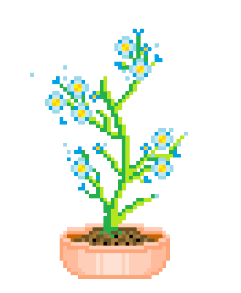

<!-- ✦ Welcome -->
<p align="center">
  
</p>
<p align="center">
  <b>ANIMA SAU</b>
  <br/>
  Computer Science Student • AI • Web • Creative Tech
</p>

<p align="center">
  
  
  
</p>

---

<!-- 🌸 Pixel Art Hero -->
<p align="left">
  
</p>

---

<!-- 🌷 About Me -->
## 🌷 About Me

- 👩🏻‍💻 Computer Science Student
- 🤖 Exploring AI & Machine Learning
- 🌐 Building Web Projects
- 💻 Interested in Frontend & Backend Development
- 🌱 Learning, building, breaking, fixing — repeat ♡

> ✦ *Turning curiosity into code, one project at a time.* ✦

---

<!-- 🌱 Currently Learning -->
## 🌱 Currently Learning

```text
🐍 Python        ████████░░ 80%
☕ Java          ███████░░░ 70%
🟨 JavaScript    ██████░░░░ 60%
🧩 DSA           █████░░░░░ 50%
🌐 Web Dev       ███████░░░ 70%
🤖 AI / ML       ████░░░░░░ 40%
```

---

<!-- 💻 Tech Stack -->
## 💻 Tech Stack

### ✦ Languages

<p>
  
  
  
  
  
  
</p>

### ✦ Database

<p>
  
  
</p>

### ✦ Frameworks & Tools

<p>
  
  
  
  
  
</p>

---

<!-- 🚀 Projects -->
## 🚀 Projects

| 🌟 Project | 💫 Description |
|:---:|:---|
| 📸 **Photo Booth** | A creative web-based photo booth experience |
| 🛰️ **NEO Monitor** | An asteroid monitoring and risk-analysis project |
| 🤖 **AI Chat Web App** | AI-powered chat application |
| 🎮 **GameBoy Emulator** | Browser-based GameBoy-style project |
| ☄️ **Interstellar Asteroid Tracker** | Tracking and analysing near-Earth asteroids |
| 🌐 **Web Projects** | Frontend & backend experiments and projects |

---

<!-- 💌 Connect With Me -->
## 💌 Connect With Me


<p align="center">

  <a href="https://github.com/animasau">
    
  </a>

  <a href="https://www.linkedin.com/in/anima-sau-a72179303/">
    
  </a>

  <a href="https://www.instagram.com/lalina2992/">
    
  </a>

  <a href="mailto:sauanima23@gmail.com">
    
  </a>

</p>

<p align="center">
  🌷 <i>Let's connect, build, and create something wonderful!</i> 🌷
</p>

<p align="center">
  🌷 <i>Let's connect, build, and create something wonderful!</i> 🌷
</p>

---

<!-- 📊 GitHub Stats -->
## 📊 GitHub Stats

<p align="center">
  
</p>

<p align="center">
  
</p>

---

<!-- 🌿 Contribution Graph -->
## 🌿 My Coding Garden

<p align="center">
  
</p>

---
<!-- 🌸 Footer -->
<div align="center">

✦ ────────────────────────────────────────────────────────────────────────────────── ✦



<h2>˚₊‧꒰ა Thanks for visiting ໒꒱ ‧₊˚</h2>

### Keep coding • Keep creating • Keep dreaming ♡

✦ ────────────────────────────────────────────────────────────────────────────────── ✦

</div>